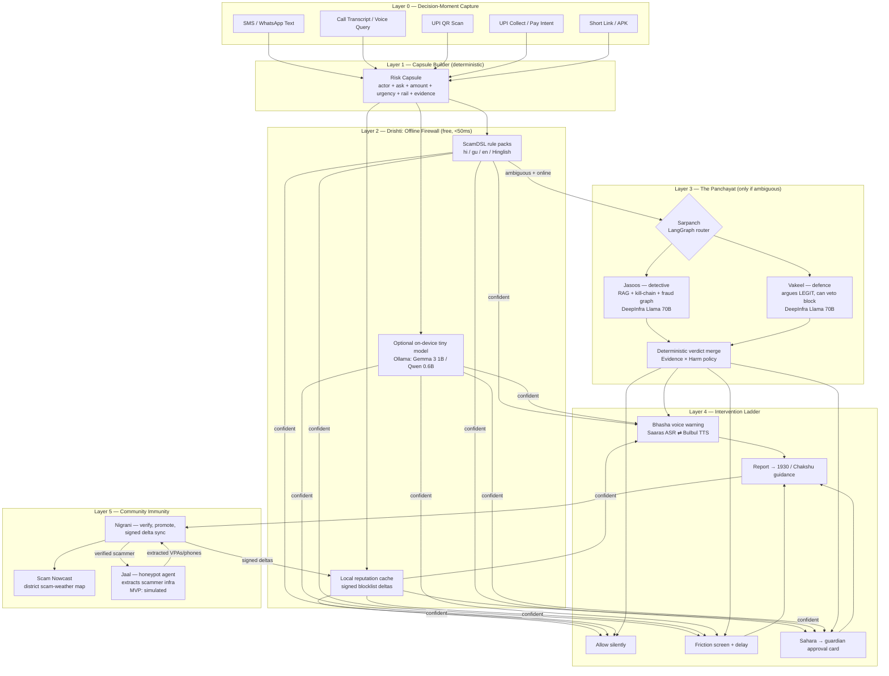

# RAKSHAK v3 (रक्षक) — The Agentic Trust Firewall
### An Agent Panchayat for Rural Digital Payments

**Track:** Financial Safety for Rural India
**Supersedes:** `RAKSHAK_Architecture_Upgraded.md` (v2). Everything in v2 that worked is kept;
this doc upgrades the *how* (agentic architecture, 2026 AI stack) and sharpens the *why us*
(USP that survives a judge who knows the space).

> **One-liner:** 2026 is the year fraud went agentic — scam operations now run AI agents against
> victims. Rakshak answers with an **Agent Panchayat**: a council of specialist AI agents that
> convenes in your pocket, in your language, in the three seconds before your money moves —
> offline when it can be, sovereign-AI-powered when it must be, and community-fed so every
> verified report becomes a trap for the scammer and a shield for the next user.

> **Tagline:** *"Scam bots attack alone. Rakshak defends as a council."*

---

## 0. What Changed from v2 → v3

| Area | v2 (previous doc) | v3 (this doc) |
|---|---|---|
| Core framing | "Trust Firewall" — layered pipeline | **Agent Panchayat** — named specialist agents deliberating, with a defence-lawyer agent protecting legit payments |
| Cloud reasoning | One "Grounded LLM Explainer" box | 7 typed agents + LangGraph orchestrator, each with a distinct job, model, and cost profile |
| AI stack | "Claude/Groq/OpenAI-compatible" (generic) | Concrete 2026 stack: **DeepInfra** (workhorse brain), **Sarvam AI** (ears/mouth/Indic brain), **Groq/Cerebras** (demo-speed + free fallback), **OpenRouter** (resilience) — with verified pricing and per-decision cost math |
| Offense | None — purely defensive | **Rakshak Jaal** — a honeypot agent that turns verified reports into extracted scammer infrastructure (simulated in MVP, precedented by O2's Daisy) |
| False positives | Implicit | **Explicit Vakeel (defence) agent** — no other team will demo protecting a *legitimate* payment from being blocked |
| Prediction | None | **Scam Nowcast** — district-level "scam weather" from report velocity |
| Pitch stats | Unsourced | Verified July-2026 numbers with sources (§12) |
| Honesty | No competitive section | §2 "claims we are NOT allowed to make" (same discipline as ViltrumX) |

---

## 1. The Exceptional USP — Five Pillars

### The framing that wins the room

Sumsub's 2025 fraud report and Experian's 2026 forecast both name **agentic AI scams as the top
fraud threat of 2026**. Scam call-centres already use LLMs to run pressure scripts at scale.
Meanwhile the defence offered to a first-time UPI user in rural India is a static blocklist and
an English-language warning label. That asymmetry is the pitch:

> **"The attacker upgraded to agents. The defender is still reading a pamphlet.
> Rakshak puts a council of agents on the defender's side."**

### Pillar 1 — The Agent Panchayat (governed multi-agent verdict)
Every risky payment moment convenes a council: a watchman agent (offline rules), a detective
agent (RAG + kill-chain), and — this is the part nobody else will have — **Vakeel (वकील), a
defence-lawyer agent whose only job is to argue the payment is legitimate.** A block verdict must
survive cross-examination. Judges see false-positive protection demoed live: Rakshak lets a
farmer's genuine mandi payment through while blocking the KYC scam seconds later. Every verdict
ships with a full provenance trace (which agent said what, which rule fired, which precedent was
retrieved) — governed decisions, not black-box scores.

### Pillar 2 — Rakshak Jaal (जाल) — community reports become traps
Today a scam report is a tombstone: it helps after the money is gone. In Rakshak, one verified
report can spawn a **honeypot agent** that engages the scammer in character (an eager, confused
victim), wastes their time, and extracts the *rest* of their infrastructure — mule VPAs, backup
phone numbers, APK links — which feeds straight into community immunity. O2's "Daisy" proved
this works at telco scale in the UK; RBI's MuleHunter.AI proves mule-hunting works at bank scale
in India. **Nobody has put the honeypot in the community's hands, fed by the community's own
reports.** (MVP: fully simulated replay of a Jaal session — see §11. Never claim it's live.)

### Pillar 3 — Sovereign AI stack at rural unit economics
Detection is deterministic and free. When the council does need a brain, it runs on **open-weight
models via DeepInfra** (Llama 3.3 70B at $0.10/M input tokens) and **Sarvam's open-sourced
Indic reasoning models** (trained on IndiaAI Mission compute); voice runs on **Sarvam Saaras v3
ASR + Bulbul v3 TTS** — Indian models, Indian languages, Hinglish code-switching, self-hostable
end-to-end. Cost per *escalated* decision ≈ ₹0.15; per spoken warning ≈ ₹0.60; offline path = ₹0.
No US frontier-lab API in the loop. That is a sovereignty story *and* a unit-economics story.

### Pillar 4 — Voice is the interface, both directions
v2 had voice warnings. v3 makes Rakshak **conversational**: a user can speak to it —
*"mujhe ye message aaya hai, paise bhejne chahiye kya?"* — Saaras v3 transcribes (23 languages,
code-mixed), the Panchayat deliberates, Bulbul v3 answers out loud in the user's language with
sub-250ms first-byte streaming. The demo moment: a judge speaks a scam message in Hindi into a
mic and hears Rakshak talk them out of it, with reasons.

### Pillar 5 — Community Immunity + Scam Nowcast
The v2 trust-pipeline stays (independent-report thresholds, reporter trust, signed blocklist
deltas). New on top: **Scam Nowcast** — report velocity clustered by district and kill-chain
pattern renders a "scam weather map" (*"KYC-fee scam wave active in Kheda district this week"*)
and pre-arms the offline rule packs of users in that district. Reactive blocklists become
anticipatory protection, and it demos beautifully on a map.

**Kept from v2, unchanged in spirit:** Risk Capsule (§5), Evidence/Harm dual scoring (§8),
friction ladder (§6), Guardian Mode (consent-based assisted safety — still the most human slide).

---

## 2. Honest Competitive Frame — claims we are NOT allowed to make

A judge who knows fintech will discount the whole pitch if one claim is checkably false.

| Who already exists | What they actually do | Our honest position |
|---|---|---|
| Google Pay / PhonePe / Paytm in-app warnings | Rail-level scam warnings, collect-request friction, some ML | They protect *their* rail, generically, in English-first UI. We protect the *decision moment* across channels (SMS/WhatsApp/call/QR), voice-first, with family in the loop. |
| Truecaller | Caller/SMS ID and spam labels at massive scale | Identifies the *sender*; doesn't reason about the *ask*, the amount, or the user's vulnerability, and doesn't block the payment moment. |
| RBI MuleHunter.AI (live in 26+ banks), IDPIC (incorporated Oct 2025) | Bank-side mule-account detection, ecosystem fraud intelligence | Bank-side and invisible to users. We are the consumer-side complement — and a future intelligence feed *into* that ecosystem, not a competitor. |
| O2 Daisy (UK), Lenny bot | Telco-scale scambaiting honeypots | Proof the honeypot works. Ours differs: community-report-triggered, India-language, feeding a user-facing blocklist. Say "inspired by," never "first ever." |
| Govt: 1930 helpline, Chakshu, cybercrime.gov.in | Reporting and takedown after the fact | We are pre-transaction. We *route into* these (report guidance), not around them. |

**Banned claims:** ❌ "first AI scam detector" ❌ "nobody does honeypots" ❌ "banks don't use AI"
✅ **Allowed:** "the first *agentic, voice-first, community-fed* firewall for the payment decision
moment of rural India" — every adjective in that sentence is load-bearing and defensible.

---

## 3. The Agent Panchayat — Roster

LangGraph-orchestrated. Deterministic layers are *services*; only ambiguity spends tokens.

| # | Agent | Hindi name | Job | Runs where | Model |
|---|---|---|---|---|---|
| — | **Sarpanch** (orchestrator) | सरपंच | Chairs the council: routes, short-circuits, enforces token/latency budgets, writes the provenance trace | LangGraph | none (code) |
| 1 | **Capsule Builder** | — | Normalizes SMS/call/QR/UPI-intent/link into one Risk Capsule (§5) | Local, deterministic | none |
| 2 | **Drishti** (watchman) | दृष्टि | ScamDSL rules + local reputation cache + structural signals. Verdict for ~80% of events with zero network | Local, deterministic | none |
| 3 | **Jasoos** (detective) | जासूस | Ambiguous cases: RAG over RBI/NPCI/1930 advisories + community patterns, maps the kill-chain (§v2 model kept), queries fraud graph | Cloud | Llama 3.3 70B @ DeepInfra |
| 4 | **Vakeel** (defence lawyer) | वकील | Adversarially argues the transaction is LEGIT. Cites innocent explanations, user history, context. Can veto a block down to a warning | Cloud | Llama 3.3 70B @ DeepInfra (separate context — genuinely independent reasoning) |
| 5 | **Bhasha** (voice of the council) | भाषा | Turns the verdict + reasons into a spoken, plain-language warning in the user's language; also handles inbound voice queries | Cloud | Sarvam Saaras v3 (ASR) + Sarvam-30B (Indic phrasing) + Bulbul v3 (TTS) |
| 6 | **Sahara** (guardian liaison) | सहारा | Builds the guardian risk card, manages approve/reject, logs overrides | Cloud/local | small model or templates |
| 7 | **Nigrani** (immunity keeper) | निगरानी | Verifies reports (independence thresholds, reporter trust), promotes blocklist levels, computes Scam Nowcast | Server-side batch | HDBSCAN-style clustering + Llama for pattern summaries (DeepInfra batch @ 50% off) |
| 8 | **Jaal** (the trap) | जाल | Honeypot persona that engages reported scammers, extracts VPAs/phones/links → feeds Nigrani. **Simulated in MVP** | Cloud (roadmap live) | Llama 3.3 70B @ Groq (real-time conversation needs low TTFT) |

**Council protocol (the demo-able part):** Drishti scores → if confident, done (offline, free).
If ambiguous: Sarpanch convenes Jasoos and Vakeel **in parallel**; their findings go to a verdict
merge (deterministic scoring, §8 — the LLMs *argue*, the policy *decides*); Bhasha explains;
Sahara escalates if critical. Full trace stored on the capsule. Total budget: <3s, <₹0.20.

---

## 4. Architecture



---

## 5. Risk Capsule (kept from v2, + provenance)

Unchanged core (see v2 §4 for the full JSON). v3 adds two fields:

```json
{
  "verdict": {
    "evidence_score": 0.82,
    "harm_score": 0.71,
    "action": "friction",
    "vakeel_veto": false,
    "explanation_key": "kyc_fee_unknown_vpa"
  },
  "panchayat_trace": [
    {"agent": "drishti", "ms": 14, "cost_inr": 0, "found": ["kyc_threat", "processing_fee"]},
    {"agent": "jasoos", "ms": 1840, "cost_inr": 0.11, "precedent": "rbi-kyc-fraud-advisory-2024"},
    {"agent": "vakeel", "ms": 1610, "cost_inr": 0.09, "argument": "no innocent explanation found", "veto": false}
  ]
}
```

The trace is the "governed decisions, not black-box AI" proof — replayable in the UI.

---

## 6. Intervention Ladder (kept) — now with named reversibility

| Risk | Behavior | Reversibility |
|---|---|---|
| Low | Allow silently | — |
| Medium | Bhasha voice warning + reasons | User proceeds anyway with one tap (logged) |
| High | Friction screen, 10s delay, spoken kill-chain | User can override after delay (logged) |
| Critical | Block, or Sahara guardian approval | Guardian/override, everything logged |

Vakeel's veto can only move a verdict *down* the ladder (block → friction), never up — the
defence lawyer can save a legit payment but can never cause a block. That asymmetry is the
safety argument, state it explicitly in the pitch.

---

## 7. The 2026 AI Stack (verified July 2026)

### 7.1 Chosen stack — one line each on *why this one*

| Layer | Choice | Why | Verified facts (Jul 2026) |
|---|---|---|---|
| Workhorse LLM (Jasoos, Vakeel, Nigrani summaries) | **DeepInfra** | Cheapest serious open-weight inference; OpenAI-compatible drop-in; batch API at 50% off for nightly Nigrani jobs | Llama 3.3 70B Turbo $0.10/$0.32 per M tokens; Llama 4 Maverick $0.15/M; DeepSeek V4 Flash $0.09/M; $1 free credit, $5 top-ups |
| Indic voice — ASR | **Sarvam Saaras v3** | 22 Indian languages + English, code-mixed/Hinglish modes (transcribe/translate/verbatim/translit/codemix) | ₹30–45/hour of audio |
| Indic voice — TTS | **Sarvam Bulbul v3** | 35+ voices, 48kHz, emotion control, sub-250ms first byte via WebSocket, Hinglish code-switching | ₹30/10K chars (v2 legacy ₹15/10K); 2,500-char cap per request |
| Indic reasoning (Bhasha phrasing) | **Sarvam-30B** | Sarvam-M is **deprecated** (don't put it on a slide); 30B/105B are its replacements — open-sourced Mar 2026, trained on IndiaAI Mission compute → the sovereignty claim is literal | Chat API ₹2.5–4 in / ₹10–16 out per 1M tokens; ₹100–1,000 free signup credits |
| Real-time speed (Jaal conversations, live demo wow) | **Groq** | Lowest time-to-first-token (<100ms) — what a live conversation needs | Free tier, no card: ~30 RPM / 1K req/day |
| Free-tier fallback | **Cerebras** | ~2,000–3,000 tok/s throughput; most generous free tier | 1M tokens/day free, no card (8K context cap on free tier) |
| Resilience | **OpenRouter** (or plain multi-base-URL config) | One API over many providers; demo-day insurance. Cheapest robust trick: Groq + Cerebras both serve `gpt-oss-120b` → primary/fallback with zero code change | — |
| Embeddings + RAG | **BGE-M3 via DeepInfra** + **Qdrant** (local Docker) | Multilingual embeddings (Hindi/Gujarati/English in one space); Qdrant runs offline in the demo | pennies |
| Orchestration | **LangGraph** | Typed graph, parallel fan-out (Jasoos ∥ Vakeel), checkpointing for the provenance trace | — |
| Offline tiny model (optional stretch) | **Ollama + Gemma 3 1B or Qwen 0.6B** | Makes "offline-first" more than rules on a slide — a 1B model classifying on a laptop with WiFi off is a demo moment | free |
| Govt/free alternative to keep in the deck | **Bhashini + AI4Bharat (IndicConformer ASR, IndicTrans2)** | Free government stack; self-host path for production; you already have IndicTrans2 experience from CrimeGPT | free |

### 7.2 Alternatives considered (so you can answer "why not X?")

- **Together AI / Fireworks** — good, but DeepInfra is cheaper on ~24 of 28 shared models; no reason to pay more at hackathon scale.
- **ElevenLabs / Deepgram** — best-in-class English voice; loses to Bulbul/Saaras on Indian-language quality, price, and the sovereignty story.
- **OpenAI/Anthropic/Gemini APIs** — would work, but breaks both the unit-economics claim and the sovereign-stack claim. Only acceptable as a hidden emergency fallback.
- **SambaNova / Novita / GMI** — fine, adds nothing over the four above.
- **Neo4j for the fraud graph** — correct for production; Postgres edges table is enough for MVP (v2 already said this — keep it).

### 7.3 Unit economics (put this slide in the deck)

- ~80% of events: Drishti decides offline → **₹0.00**
- Escalated case: Jasoos + Vakeel ≈ 10K in / 2K out on Llama 3.3 70B ≈ $0.0017 → **≈ ₹0.15**
- Spoken warning: ~200 chars Bulbul v3 → **≈ ₹0.60** (the *voice* is the expensive part — say this out loud, it shows you did the math)
- Blended: **under ₹1 per protected decision**, vs. median reported UPI fraud loss in the
  thousands. Protection costs less than an SMS.

### 7.4 `.env` keys the repo needs

```
DEEPINFRA_API_KEY=      # https://deepinfra.com — $1 free, no card
SARVAM_API_KEY=         # https://dashboard.sarvam.ai — free signup credits
GROQ_API_KEY=           # https://console.groq.com — free tier, no card
CEREBRAS_API_KEY=       # https://cloud.cerebras.ai — 1M tokens/day free
```

---

## 8. Scoring (kept from v2, + one addition)

Evidence Score and Harm Score exactly as v2 §6. One addition — the merge rule:

```text
verdict = policy(evidence, harm)              # v2 ladder, unchanged
if verdict == block and vakeel.veto:
    verdict = friction                        # defence can downgrade, never upgrade
    capsule.trace += vakeel.argument          # and must show its reasoning
```

LLMs contribute *arguments and retrieved precedents* that adjust evidence inputs; they never
emit the final number. Deterministic policy decides. This line wins the technical-credibility
question every time.

---

## 9. Community Immunity + Scam Nowcast

v2 §7 trust pipeline kept whole (independent reports, reporter trust, signed deltas, four
protection levels). Additions:

1. **Nowcast:** Nigrani clusters verified reports by (district × kill-chain pattern × 7-day
   velocity). Output: a heat-map + one-line advisories ("Electricity-bill scam wave: Anand,
   Kheda"). High-velocity patterns pre-push rule-pack updates to that district's users.
2. **Jaal feedback loop:** identifiers extracted by the honeypot agent enter the same
   verification pipeline as human reports (they're evidence, not auto-blocks) — poisoning
   resistance stays intact.

---

## 10. MVP Scope (re-tiered for the hackathon build)

**Core — must work live, end-to-end:**
1. Risk Capsule API (text/QR/transcript in → capsule out)
2. Drishti offline firewall — rule packs (hi/gu/en/Hinglish) + local blocklist, zero network
3. Panchayat for ambiguous cases — LangGraph: Jasoos (RAG over 30–50 curated patterns) ∥ Vakeel → merged verdict with full trace
4. Bhasha voice — Saaras ASR in + Bulbul TTS out, Hindi + Gujarati, the 3 demo scenarios
5. Community dashboard — reports, velocity, promotion to blocklist, **Nowcast map**
6. Guardian Mode — approval card flow

**Stretch:**
7. Jaal simulated session replay (pre-scripted transcript rendered as if live, clearly labeled "simulation")
8. Ollama on-device tiny-model demo (WiFi-off moment)
9. Voice *query* mode (speak a suspicious message, hear the verdict)

**Do NOT build (unchanged from v2):** real SMS interception, Android accessibility service,
call screening, production on-device ML, live scammer engagement.

---

## 11. Demo Script (upgraded)

1. **Offline catch** — prize + fee + unknown VPA. Airplane mode ON. Drishti blocks in 40ms,
   Hindi voice explains. *"It works with no internet and costs zero rupees."*
2. **The Panchayat deliberates** — ambiguous electricity-bill threat. Show the trace UI live:
   Jasoos finds the RBI advisory precedent; Vakeel argues "user has paid this biller before";
   verdict lands on friction, not block. *"AI argues, policy decides — and there's a defence
   lawyer for your legit payments."* Then run a genuine payment through — allowed silently.
3. **Voice conversation** — judge speaks a scam SMS in Hindi into the mic; Rakshak answers
   out loud in Hindi with three reasons and the 1930 guidance.
4. **Community immunity + Nowcast** — User A reports `fraudhelp@upi` → velocity → district
   blocklist → User B's QR scan blocked from local cache; map lights up Kheda district.
5. **Jaal replay** — "when the community verified that VPA, our honeypot agent went to work."
   Show the (simulated, labeled) transcript: agent plays confused victim, scammer reveals two
   more mule VPAs → they appear in the blocklist. *"One grandmother's report just protected
   every user in three districts — and cost the scammer an hour."*
6. **Guardian Mode** — critical verdict → Sahara card → guardian rejects. Close on the tagline.

---

## 12. Pitch Numbers (verified July 2026 — cite, don't inflate)

- UPI fraud: **₹805 crore across 10.64 lakh incidents in FY26 through November** (Parliament
  data); FY24 peak ₹1,087 crore / 13.42 lakh cases.
- Total cyber fraud 2025: **≈ ₹22,495 crore**, ~2.81M complaints (MHA/I4C).
- **Only ~6% of fraud chargebacks recovered** → prevention is the only economics that work.
- **1 in 5 UPI-user families** hit by fraud; **51% never report** (LocalCircles) → community
  reporting UX matters.
- **524,121 mule accounts flagged in March 2026 alone** (520,559 of them VPAs) → the mule-VPA
  intelligence Jaal extracts is exactly what the ecosystem is hunting.
- Scale: UPI did 228B transactions in 2025, 500M+ users — the blast radius of one good defence.

---

## 13. Build Plan / Repo Layout

```
rakshak/
├── README.md
├── .env.example
├── backend/
│   ├── requirements.txt
│   ├── demo.py                    # runs demo scenarios end-to-end offline
│   └── app/
│       ├── main.py                # FastAPI: POST /analyze, /report, /guardian
│       ├── capsule.py             # Risk Capsule pydantic models + extractor
│       ├── scoring.py             # evidence + harm + policy ladder + vakeel merge
│       ├── reputation.py          # local blocklist cache (signed deltas later)
│       ├── rules/
│       │   ├── engine.py          # ScamDSL engine
│       │   └── packs/core_v1.yaml # hi/gu/en/Hinglish rules, kill-chain tagged
│       ├── agents/
│       │   ├── orchestrator.py    # Sarpanch — LangGraph graph
│       │   ├── jasoos.py          # detective (RAG + kill-chain)
│       │   ├── vakeel.py          # defence lawyer
│       │   ├── bhasha.py          # voice explainer (Saaras/Bulbul)
│       │   └── jaal.py            # honeypot (simulated transcript player)
│       └── providers/
│           ├── deepinfra.py       # OpenAI-compatible client
│           ├── sarvam.py          # ASR/TTS/chat client
│           └── groq.py            # low-latency client
├── frontend/                      # React — decision screen, trace UI, Nowcast map,
│                                  # guardian card, community dashboard
└── data/
    ├── blocklist.json             # seeded community blocklist
    └── scam_patterns/             # 30–50 curated RAG documents
```

Build order: deterministic spine first (capsule → rules → scoring → demo.py, zero API keys
needed), then Panchayat, then voice, then dashboard/Nowcast, then Jaal replay + polish.

---

## 14. Final Claim

> **Rakshak is not another scam classifier. It is an Agent Panchayat for the payment moment:
> offline and free when it can be, a council of sovereign Indian AI when it must be, with a
> defence lawyer for your legitimate payments, a honeypot for the scammer's infrastructure,
> and a community that gets immune — one verified report at a time.**
